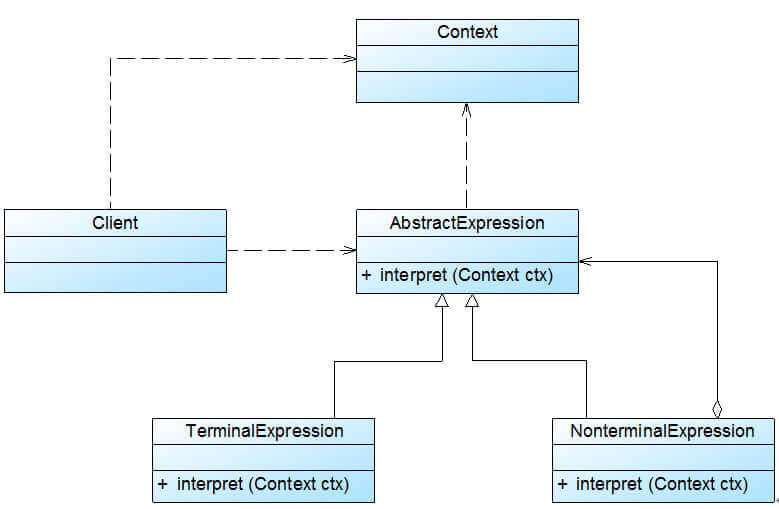

# 解释器模式

> 解释器模式(Interpreter Pattern)：定义一个语言的文法，并且建立一个解释器来解释该语言中的句子，这里的“语言”是指使用规定格式和语法的代码。解释器模式是一种类行为型模式。

**举例：**

说到解释器模式，我们的编译器，在对代码进行编译的时候也用到了该模式。我们可以直接来做一个简单的解释器，一个给机器人下发指令的解释器。

| **命令**           | **参数**                   |
| ------------------ | -------------------------- |
| direction 移动方向 | 'up' 'down' 'left' 'right' |
| action 移动方式    | 'move' 'run'               |
| distance 移动距离  | an integer                 |
| 表达式终结符号     | ';'                        |

通过建立一个映射关系可以很快将指令转换成行为，例如`up run 5;` 表示向上跑5米，而`left move 12;` 表示向左移动12米。

### 优点：

- 易于改变和扩展文法。由于在解释器模式中使用类来表示语言的文法规则，因此可以通过继承等机制来改变或扩展文法。
- 每一条文法规则都可以表示为一个类，因此可以方便地实现一个简单的语言。
- 实现文法较为容易。在抽象语法树中每一个表达式节点类的实现方式都是相似的，这些类的代码编写都不会特别复杂，还可以通过一些工具自动生成节点类代码。
- 增加新的解释表达式较为方便。如果用户需要增加新的解释表达式只需要对应增加一个新的终结符表达式或非终结符表达式类，原有表达式类代码无须修改，符合“开闭原则”。

### 缺点:

- 对于复杂文法难以维护。在解释器模式中，每一条规则至少需要定义一个类，因此如果一个语言包含太多文法规则，类的个数将会急剧增加，导致系统难以管理和维护，此时可以考虑使用语法分析程序等方式来取代解释器模式。
- 执行效率较低。由于在解释器模式中使用了大量的循环和递归调用，因此在解释较为复杂的句子时其速度很慢，而且代码的调试过程也比较麻烦。