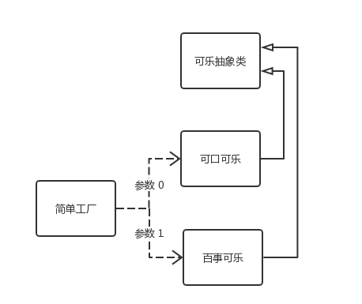

# 简单工厂模式

> 简单工厂模式(Simple Factory Pattern)：专门定义一个类（工厂类）来负责创建其他类的实例。可以根据创建方法的参数来返回不同类的实例，被创建的实例通常都具有共同的父类。

### 举例

简单工厂模式像一个代工厂，一个工厂可以生产多种产品。举个例子，一个饮料加工厂同时帮百事可乐和可口可乐生产，加工厂根据输入参数`Type`来生产不同的产品。

### 优点

- 使用者只需要给工厂类传入一个正确的约定好的参数，就可以获取你所需要的对象，而不需要知道其创建细节，一定程度上减少系统的耦合。
- 客户端无须知道所创建的具体产品类的类名，只需要知道具体产品类所对应的参数即可，减少开发者的记忆成本。

### 缺点

- 如果业务上添加新产品的话，就需要修改工厂类原有的判断逻辑，这其实是违背了开闭原则的。
- 在产品类型较多时，有可能造成工厂逻辑过于复杂。所以简单工厂模式比较适合产品种类比较少而且增多的概率很低的情况。