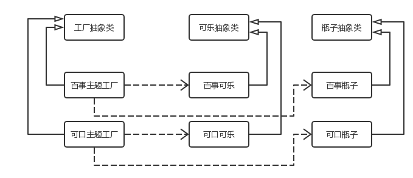

# 抽象工厂模式

> 抽象工厂模式(Abstract Factory Pattern)：提供一个创建一系列相关或相互依赖对象的接口，而无须指定它们具体的类。

**举例：**

抽象工厂和工厂方法不同的地方在于，生产产品的工厂是抽象的。举例，可口可乐公司生产可乐的同时，也需要生产装可乐的瓶子和箱子，瓶子和箱子也是可口可乐专属定制的，同样百事可乐公司也会有这个需求。这个时候我们的工厂不仅仅是生产可乐饮料的工厂，还必须同时生产同一主题的瓶子和箱子，所以它是一个抽象的主题工厂，专门生产同一主题的不同商品。

### 优点：

- 具体产品在应用层代码隔离，不需要关心产品细节。只需要知道自己需要的产品是属于哪个工厂的即可 当一个产品族中的多个对象被设计成一起工作时，它能够保证客户端始终只使用同一个产品族中的对象。这对一些需要根据当前环境来决定其行为的软件系统来说，是一种非常实用的设计模式。

### 缺点：

- 规定了所有可能被创建的产品集合，产品族中扩展新的产品困难，需要修改抽象工厂的接口。

