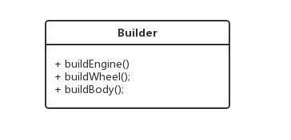

# 生成器模式

> 生成器模式(Builder Pattern)：也叫创建者模式，它将一个复杂对象的构建与它的表示分离，使得同样的构建过程可以创建不同的表示。

**举例：**

生成器模式将复杂的创建逻辑进行分割，例如生产汽车，分步骤创建安装不同的零件。如果创建逻辑简单则没有拆分的必要。

### 优点

* 客户端不必知道产品内部组成的细节，将产品本身与产品的创建过程解耦，使得相同的创建过程可以创建不同的产品对象。

* 每一个具体建造者都相对独立，而与其他的具体建造者无关，因此可以很方便地替换具体建造者或增加新的具体建造者， 用户使用不同的具体建造者即可得到不同的产品对象 。

* 增加新的具体建造者无须修改原有类库的代码，指挥者类针对抽象建造者类编程，系统扩展方便，符合“开闭原则”。

* 可以更加精细地控制产品的创建过程 。将复杂产品的创建步骤分解在不同的方法中，使得创建过程更加清晰，也更方便使用程序来控制创建过程。

### 缺点

- 建造者模式所创建的产品一般具有较多的共同点，其组成部分相似，如果产品之间的差异性很大，则不适合使用建造者模式，因此其使用范围受到一定的限制。
- 如果产品的内部变化复杂，可能会导致需要定义很多具体建造者类来实现这种变化，导致系统变得很庞大。

