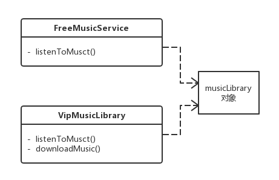

# 享元模式

> 享元模式(Flyweight Pattern)：运用共享技术复用大量细粒度的对象,降低程序内存的占用,提高程序的性能。

**举例：**

例如 UITableViewCell 的缓存机制，达到降低内存消耗的目的。举例，音乐服务根据收费划分出免费用户和会员用户，免费用户只能听部分免费音乐，会员用户可以听全部的音乐，并且可以下载。虽然权限上二者间有一些区别，但是他们所享受的音乐来是自于同一个音乐库，这样所有的音乐都只需要保存一份就可以了。另外如果出现音乐库里没有的音乐时，则需要新增该音乐，然后其他服务也可以享受新增的音乐，相当于享元池或缓存池的功能。

享元模式区保证共享内部状态如音乐库，而外部状态根据不同需求定制如各种访问权限，使用中不能去改变内部状态，以达到共享的目的。

**特殊说明：**

go语言的pool资源池就是享元模式

### 优点：

- 使用享元模可以减少内存中对象的数量，使得相同对象或相似对象在内存中只保存一份，降低系统的使用内存，也可以提性能。
- 享元模式的外部状态相对独立，而且不会影响其内部状态，从而使得享元对象可以在不同的环境中被共享。

### 缺点：

- 使用享元模式需要分离出内部状态和外部状态，这使得程序的逻辑复杂化。
- 对象在缓冲池中的复用需要考虑线程问题。

