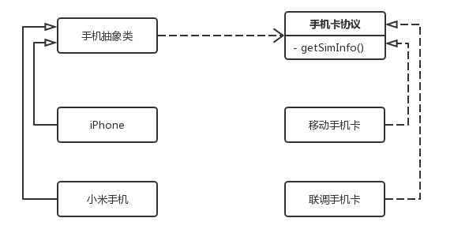

# 桥接模式

> 桥接模式(Bridge Pattern)：将抽象部分与它的实现部分分离,使它们都可以独立地变化。

**举例：**

尽管手机都有各自的不同之处，但是他们都有一个手机卡卡槽，卡槽里可以插不同运营商的卡。不管手机和卡内部如何改变，只要卡槽的行业标准没有变，就都可以正常使用。桥接模式在于将复杂的类进行分割，优先对象组合的方式，就像将手机里的手机卡抽离出去新建一个类，实现手机实例持有一个手机卡实例的组合方式。而不是通过继承来新建多个不同手机卡的手机子类。

`SIMCardProtocol`协议相当于行业标准，所以手机卡都要遵循该协议。而各个手机生产商知道该协议，就可以直接利用该协议获得 SIM 卡内部信息。

### 优点：

- 扩展性好，符合开闭原则：将抽象与实现分离，让二者可以独立变化

### 缺点：

- 在设计之前，需要识别出两个独立变化的维度。