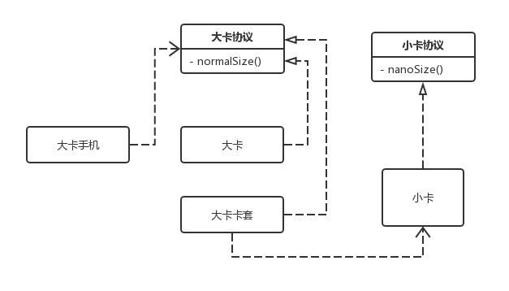

# 适配器模式

> 适配器模式(Adapter Pattern) ：将一个接口转换成客户希望的另一个接口，使得原本由于接口不兼容而不能一起工作的那些类可以一起工作。适配器模式的别名是包装器模式（Wrapper），是一种结构型设计模式

**举例：**

适配器模式顾名思义，比如内地用像港版插头需要一个转接头。再比如iPhone的手机卡是特别小的 Nano 卡，把 Nano 卡拿到其他手机上不能贴合卡槽尺寸，所以我们需要加一个符合卡槽尺寸的卡套。

### 优点：

- 符合开闭原则：使用适配器而不需要改变现有类，提高类的复用性。
- 目标类和适配器类解耦，提高程序扩展性。

### 缺点：

- 增加了系统的复杂性