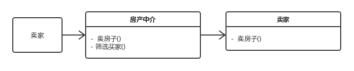

# 代理模式

> 代理模式(Proxy Pattern) ：为某个对象提供一个代理，并由这个代理对象控制对原对象的访问。

**举例：**

代理模式像一个房屋中介，买家只能通过中介来买房，代理具备被代理类的所有功能，就像房东有卖房功能，中介也具有卖房功能。此外代理实例还可以帮助被代理实例进行一些额外处理，比如中介可以帮助房东筛选优质买家的功能，帮助房东pass掉一些不符合条件的买家。还有消息队列也是该模式。

### 优点：

- 降低系统的耦合度：代理模式能够协调调用者和被调用者，在一定程度上降低了系统的耦合度。
- 不同类型的代理可以对客户端对目标对象的访问进行不同的控制：
  - 远程代理,使得客户端可以访问在远程机器上的对象，远程机器可能具有更好的计算性能与处理速度，可以快速响应并处理客户端请求。
  - 虚拟代理通过使用一个小对象来代表一个大对象，可以减少系统资源的消耗，对系统进行优化并提高运行速度。
  - 保护代理可以控制客户端对真实对象的使用权限。

### 缺点：

- 由于在客户端和被代理对象之间增加了代理对象，因s此可能会让客户端请求的速度变慢。

